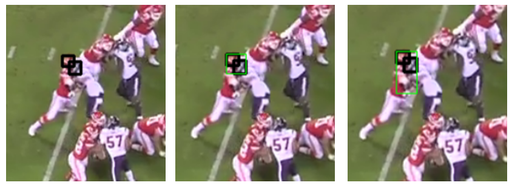
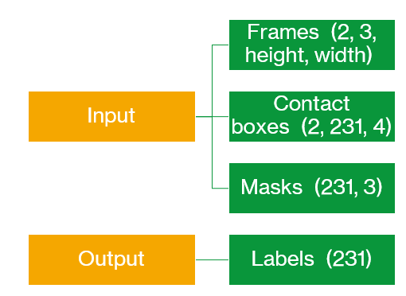
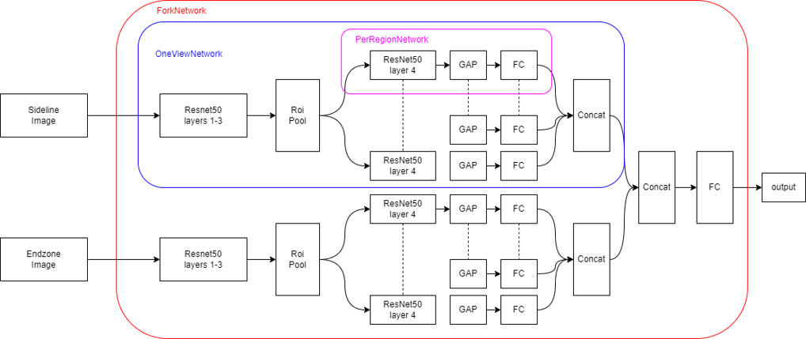
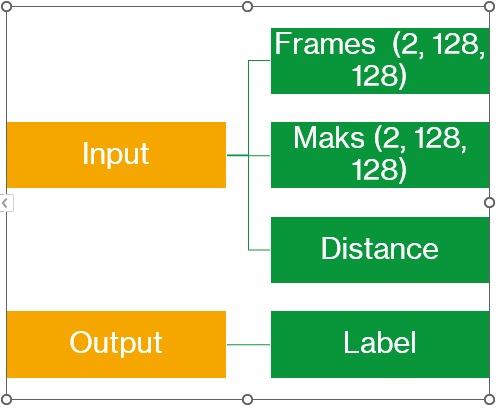
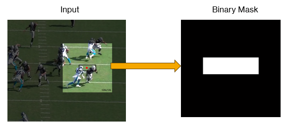
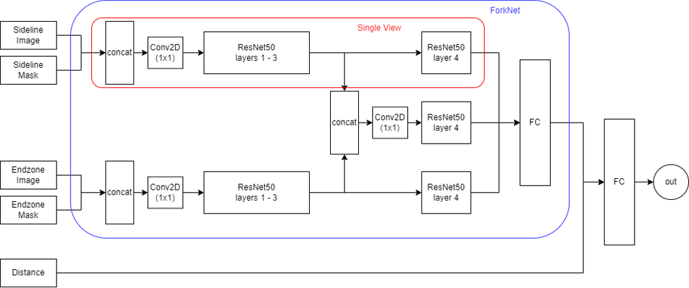
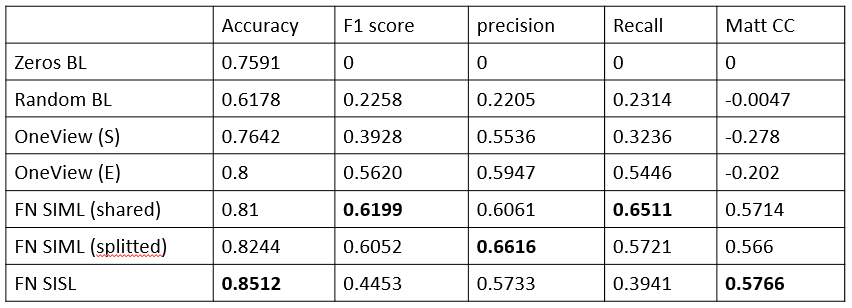

# NFL Player Contact Detection

This project is designed to detect contacts between players during NFL games. We utilize both tracking data and video feeds to achieve this. To focus on the most relevant interactions, we've excluded contacts involving players not visible on camera and contacts with the ground.

## Data

The project leverages the following data sources:

- Two video feeds from different angles: Sideline and Endzone, recorded at a frame rate of 59.94Hz
- Bounding boxes representing the location of player's helmets
- Player tracking data, recorded at a frequency of 10Hz

## Pre-Processing

We've pre-processed the data to ensure its relevance and accuracy. This involved:

- Filtering out irrelevant data
- Removing inconsistent data entries
- Excluding contacts with the ground
- Merging labels, distances between players, and helmet bounding box data into a unified dataframe
- Computing bounding boxes for contacts

## Contact Boxes
In order to detect the presence of a contact between two players we will have to focus on the portion of the image interested by the contact. We can find it by using the information of the bounding boxes and making the following assumptions:

- The contacts will likely happen in the space between the two players, i.e. in the space bewteen the helmets
- In football the contact often happens between hands vs shoulders or hand vs chest. For this reason we need to consider also the region below the helmets
  
Therefore we calculate the region between the helmets by merging the boxes of the helmets.

## Masking

We've applied masking to exclude all contacts where:

- One or both players are not visible
- The distance between the two players exceeds the 99th percentile of the distances observed in actual contacts

## Memory Management

To ensure efficient memory usage, we've implemented the following measures:

- Reduced the resolution of the video from 720x1280 to 360x640
- Reduced the number of frames analyzed by sampling one frame every three
- Converted and stored data in the Hierarchical Data Format (HDF)

## Networks

### ForkNet SIML (Single Image Multi Label)

This network is designed to classify different regions within the input images. Each image contains multiple regions defined by overlapping bounding boxes.

The input is as follows:

The image below provides an overview of the network architecture:

### ForkNet SISL (Single Image Single Label)

This network takes the following as input:

- A 128x128 cropped input image (Sideline and Endzone)
- A 128x128 binary image of the contact box (Sideline and Endzone)

The following image illustrates how the mask works:

The image below provides an overview of the network architecture:

## Results

The table below presents the results of our analysis:

